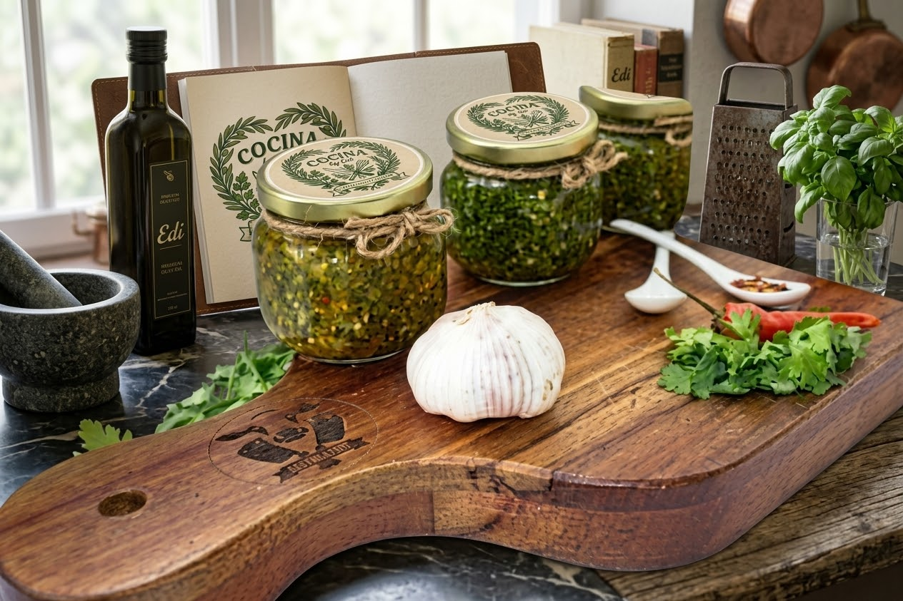
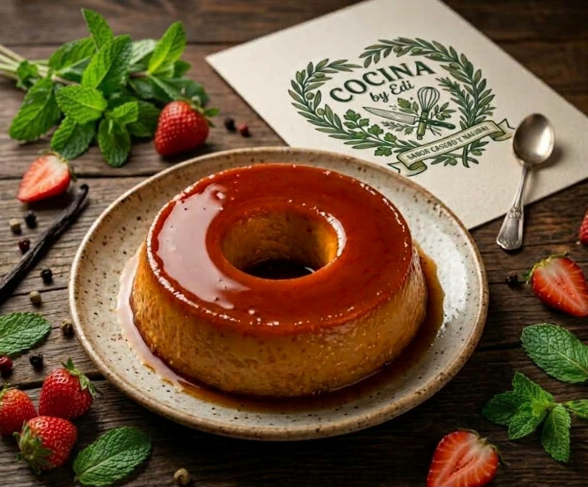
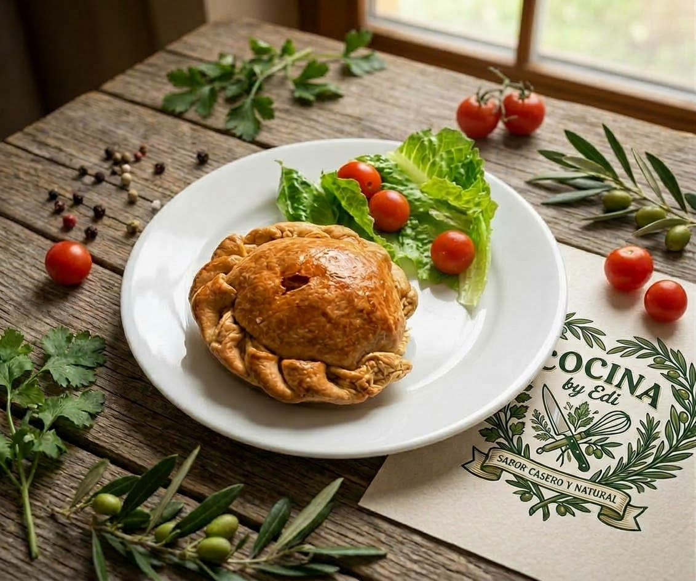
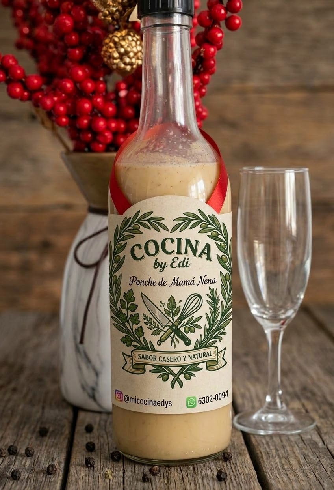
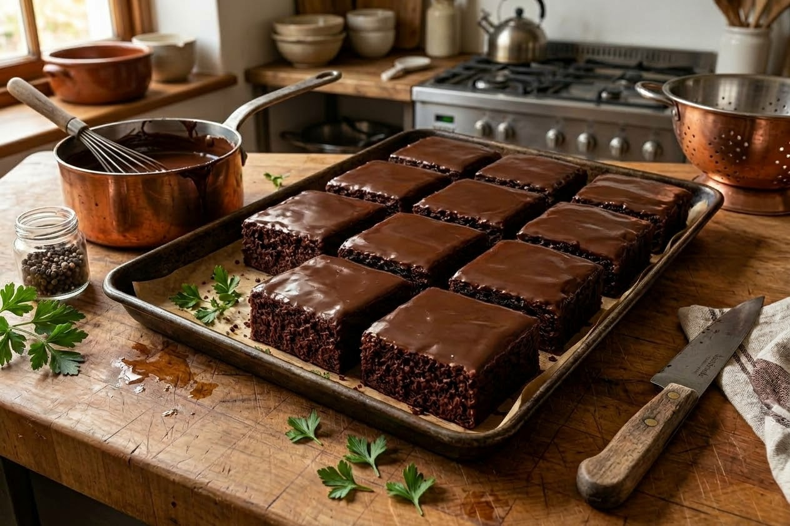

<!DOCTYPE html>
<html lang="es">
    <head>
        <meta charset="UTF-8">
        <meta name="viewport" content="width=device-width, initial-scale=1.0">
        <meta http-equiv="Content-Security-Policy" content="default-src 'self'; img-src 'self' data:; media-src 'self'; style-src 'self'; script-src 'self'; connect-src 'self'; font-src 'self'; base-uri 'self'; form-action 'self'; object-src 'none'; upgrade-insecure-requests;">
        <meta name="referrer" content="strict-origin-when-cross-origin">
        <meta name="robots" content="index,follow">
        <link rel="icon" href="Logo web.jpeg" type="image/jpeg">
        <link rel="stylesheet" href="Estilo Cocina by edi.css">
        
        <title>Mi Cocina By Edi</title>
    </head>
    <body>
        

            <h2>Mi Cocina By Edi</h2>
            
Productos frescos, caseros y con sabor a hogar.

        

        <a href="contactos.html" class="pestana-contacto" aria-label="Ir a contactos">Contactos</a>

        <main class="contenido-web">
            <h1 class="logo">
                <button class="logo-ampliable" type="button" aria-label="Ampliar logo de Mi Cocina By Edi" data-logo-ampliable>
                    
                </button>
                Mi Cocina By Edi
            </h1>
            
Bienvenidos a nuestra cocina.

            
Acá podrás ver nuestras recetas, productos y promociones.

            

                <label class="campo-busqueda">
                    Buscar un plato
                    <input type="search" data-busqueda-productos placeholder="Ej.: brownie, flan..." autocomplete="off">
                </label>
                <label class="campo-categoria">
                    Categoría
                    <select data-filtro-categoria>
                        <option value="todos">Todas</option>
                        <option value="salsas">Salsas</option>
                        <option value="platos">Platos principales</option>
                        <option value="postres">Postres</option>
                        <option value="bebidas">Bebidas</option>
                    </select>
                </label>
            

            <section class="menu-comidas" id="menu-comidas" aria-label="Menú de comidas">
                <a class="link-producto" data-categoria="salsas" href="producto.html?producto=chimichurri">
                    <article class="tarjeta-comida">
                        
                        

                            <h3>Chimichurri</h3>
                            
Salsa casera con hierbas y especias, ideal para acompañar tus comidas.

                            

                                Precio
                                <strong>Consultar</strong>
                            

                        

                    </article>
                </a>

                <a class="link-producto" data-categoria="postres" href="producto.html?producto=flan">
                    <article class="tarjeta-comida">
                        
                        

                            <h3>Flan casero</h3>
                            
Flan suave con caramelo, preparado al estilo de la casa.

                            

                                Precio
                                <strong>Consultar</strong>
                            

                        

                    </article>
                </a>

                <a class="link-producto" data-categoria="postres" href="producto.html?producto=pai">
                    <article class="tarjeta-comida">
                        
                        

                            <h3>Pie casero</h3>
                            
Preparación horneada de la casa, ideal para compartir.

                            

                                Precio
                                <strong>Consultar</strong>
                            

                        

                    </article>
                </a>

                <a class="link-producto" data-categoria="bebidas" href="producto.html?producto=ponche">
                    <article class="tarjeta-comida">
                        
                        

                            <h3>Ponche de Mamá Nena</h3>
                            
Ponche casero de la casa, servido bien frío.

                            

                                Precio
                                <strong>Consultar</strong>
                            

                        

                    </article>
                </a>

                <a class="link-producto" data-categoria="postres" href="producto.html?producto=brownie">
                    <article class="tarjeta-comida">
                        
                        

                            <h3>Brownie casero</h3>
                            
Brownie de chocolate con una cubierta suave, ideal para compartir.

                            

                                Precio
                                <strong>Consultar</strong>
                            

                        

                    </article>
                </a>

                <a class="link-producto" data-categoria="postres" href="producto.html?producto=cheesecake-maracuya">
                    <article class="tarjeta-comida">
                        
                        

                            <h3>Cheesecake de maracuyá</h3>
                            
Cheesecake cremoso con cobertura frutal de maracuyá.

                            

                                Precio
                                <strong>Consultar</strong>
                            

                        

                    </article>
                </a>

                <a class="link-producto" data-categoria="postres" href="producto.html?producto=dulce-zanahoria">
                    <article class="tarjeta-comida">
                        
                        

                            <h3>Torta de zanahoria</h3>
                            
Torta de zanahoria con cobertura cremosa, de sabor casero.

                            

                                Precio
                                <strong>Consultar</strong>
                            

                        

                    </article>
                </a>

                <a class="link-producto" data-categoria="postres" href="producto.html?producto=volteado-pina">
                    <article class="tarjeta-comida">
                        
                        

                            <h3>Volteado de piña</h3>
                            
Pastel casero de piña con caramelo y cerezas.

                            

                                Precio
                                <strong>Consultar</strong>
                            

                        

                    </article>
                </a>
            </section>
        </main>

        <section class="comercial-final" aria-label="Comercial final">
            

                Comercial
                <h3>Sabores de hogar, hechos para compartir.</h3>
                
Descubre platos caseros, frescos y llenos de cariño en cada bocado.

            

            <a href="Cocina by edi.html#menu-comidas" class="boton-comercial">Ver el menú</a>
        </section>

        <section class="video-comercial" aria-labelledby="titulo-video-comercial">
            <h2 id="titulo-video-comercial">Nuestro comercial</h2>
            <video controls playsinline preload="metadata">
                <source src="Comercial.mp4" type="video/mp4">
                Tu navegador no puede reproducir este video.
            </video>
        </section>

        <dialog class="visor-logo" aria-label="Logo ampliado de Mi Cocina By Edi" data-visor-logo>
            <button class="cerrar-visor-logo" type="button" aria-label="Cerrar logo ampliado" data-cerrar-visor>×</button>
            
        </dialog>
    </body>
</html>

